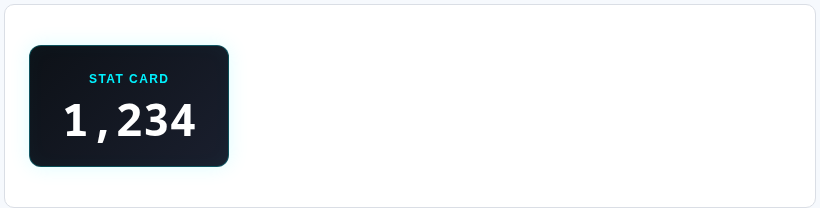
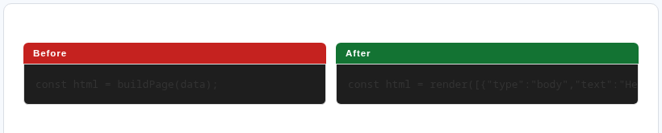
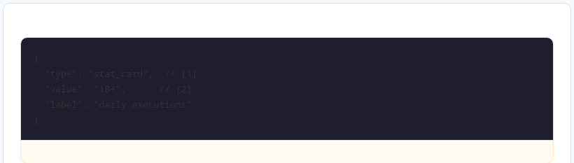

<div align="center">

# A2UI Catalogue

**A component vocabulary for agent-driven interfaces.**  
The model names an atom. The renderer compiles the HTML, CSS, SVG, and animation.

[](atoms/)
[](apps-script-surface/)
[](spec/)
[](LICENSE)
[](renderers/a2ui_v1.py)

*Independent, unofficial catalog — not affiliated with or endorsed by Google. A2UI is Google's protocol; the official spec lives at [a2ui.org](https://a2ui.org).*

</div>

---

## The idea

Rather than asking an agent to generate custom UI every turn — expensive, fragile, unpredictable — give it a stable vocabulary of atoms and let it compose from those.

```
Raw HTML   609 tok  ████████████████████████████████████████
OpenUI     287 tok  ███████████████████
A2UI        68 tok  ████
```

Fewer tokens to describe the same UI. The model names an atom; the renderer expands it into the full HTML server-side, and that expansion never re-enters the model's context window. (The efficiency framing here is still being validated — see `benchmarks/BENCHMARK.md` for the current methodology.)

> **Work in progress.** The atom vocabulary itself is stable; what it's *for* is still being explored. The live catalog and this repo are the vocabulary and its renderers — applying that vocabulary to new use cases (rendering a CLI's own output, for instance, in a sibling project not yet published) is ongoing, not finished.

A few atoms, live on the site — click through to a full spec + fields table for each:

<table>
<tr>
<td align="center"><a href="https://a2uicatalog.ai/atoms/glowing_stat/"></a><br><a href="https://a2uicatalog.ai/atoms/glowing_stat/"><code>glowing_stat</code></a></td>
<td align="center"><a href="https://a2uicatalog.ai/atoms/stat_card/"></a><br><a href="https://a2uicatalog.ai/atoms/stat_card/"><code>stat_card</code></a></td>
</tr>
<tr>
<td align="center"><a href="https://a2uicatalog.ai/atoms/before_after/"></a><br><a href="https://a2uicatalog.ai/atoms/before_after/"><code>before_after</code></a></td>
<td align="center"><a href="https://a2uicatalog.ai/atoms/annotated_code/"></a><br><a href="https://a2uicatalog.ai/atoms/annotated_code/"><code>annotated_code</code></a></td>
</tr>
</table>

[Browse all 450+ atoms →](https://a2uicatalog.ai/)

---

## Google Apps Script renderer — try it live

**450+ atoms running natively in Google Apps Script.** No CDN, no dependencies, no server. Paste a JSON block list, get a rendered page.

```json
{
  "title": "Hello A2UI",
  "theme": "light",
  "blocks": [
    { "type": "heading", "level": 1, "text": "My first A2UI page" },
    { "type": "callout", "icon": "💡", "text": "Built with 450+ atoms in Google Apps Script." },
    { "type": "chartjs_bar", "title": "Quick chart", "bar_color": "#6366f1",
      "data": [{ "label": "A", "value": 80 }, { "label": "B", "value": 45 }, { "label": "C", "value": 62 }] }
  ]
}
```

### What's in the GAS renderer

| Feature | Detail |
|---|---|
| **450+ atoms, growing** | Apps Script surface — superset of the web article renderer |
| **CSS-only interactions** | Tabs, carousel, gallery lightbox, modals, accordions — zero JS required |
| **Inline SVG charts** | Bar, line, pie, donut, heatmap, punch card, sankey, cohort retention, GitHub activity grid |
| **8 form input types** | text, email, select, radio, checkbox, switch, slider, date — native HTML controls |
| **Animation fallbacks** | 32 motion atoms degrade to readable content cards |
| **No CDN** | Works inside GAS sandboxed iframes with no external requests |
| **Large payload support** | Automatically switches to POST for schemas too large for a URL |

### Deploy your own renderer (recommended)

The renderer is fully open source. Deploy your own instance — you own the URL, you own the deployment, no dependency on the catalog's demo endpoint.

```bash
git clone https://github.com/a2uicatalog/a2ui
cd a2ui/apps-script-surface/gas-schema-renderer
clasp login
clasp create --type webapp --title "My A2UI Renderer"
clasp push
clasp deploy
# → Your renderer is live at https://script.google.com/macros/s/YOUR_ID/exec
```

Call it with any payload from the catalog (illustrative — `encode()` stands in for gzip + base64url of the JSON, see `scripts/make_url.py` for the exact encoding):

```javascript
function doGet() {
  const blocks = [
    { type: "stat_card", value: "1,234", label: "Daily users", delta: "+12%", is_up: true },
    { type: "progress_bar", value: 75, label: "Q2 target" }
  ];
  const url = "https://script.google.com/macros/s/YOUR_ID/exec";
  return HtmlService.createHtmlOutput(
    `<script>window.location="${url}?p=${encode(blocks)}"</script>`
  );
}
```

The catalog's "Try it live" button uses a shared demo instance of the same renderer. For anything beyond exploration, deploy your own.

---

## What's in this repo

| Directory | Contents |
|---|---|
| `atoms/` | Atom schema definitions (`schema.yaml`) |
| `renderers/` | Surface renderers — `web_article.py` is the canonical web renderer |
| `apps-script-surface/` | **GAS renderer** — `atom.gs` + atom files (450+ atoms, no CDN) |
| `components/` | Lit Web Components for the meet-stage surface |
| `scripts/` | Build pipeline — atom pages, `spec.json`, MCP bundle, README compat matrix, link/brand checks |
| `vendors/` | Landscape analysis of 9 UI libraries mapped to A2UI atoms |
| `benchmarks/` | OpenUI comparison benchmark — token counts across 7 scenarios |
| `spec/` | Internal state/action contracts (gdm-v0.2, a2ui-state-v1) — the A2UI v1.0 candidate spec itself lives at [a2ui.org](https://a2ui.org/specification/v1.0-a2ui/), not vendored here |
| `examples/` | Playbook YAML examples |
| `knowledge-catalogue/` | Curriculum-to-atom pipeline — schema-validated curriculum markdown (Brevet 2026, NIST AI RMF) compiled into A2UI payloads. Separate concern from the atom vocabulary itself. |

---

## 450+ atoms across 8 surfaces

Atoms declare which surfaces they support at the schema level. An agent picks an atom by name, supplies parameters, and the renderer handles the rest.

```json
[{
  "type": "stat_card",
  "label": "Atoms published",
  "value": "450+",
  "delta": "+12 this week"
}]
```

Agents **never** write HTML. They compose from the vocabulary.

---

## Surface compatibility

Every atom declares, at the schema level, which of the **8 surfaces** it works on and where it degrades (with a note explaining the caveat). The matrix below is generated straight from [`public/spec.json`](https://a2uicatalog.ai/spec.json) — the same file agents consume — so this README can no longer drift from the catalog.

<details>
<summary><strong>View full compatibility matrix (all atoms × 8 surfaces)</strong></summary>

<!-- compat-matrix:start -->
473 atoms · generated from `public/spec.json` by `scripts/gen_compat_matrix.py` — do not edit by hand.

| Atom | web | gas-web | gas-panel | meet | chat | mcp-apps | email | pdf | Source · license |
|---|---|---|---|---|---|---|---|---|---|
| `abbr_tooltip` | ✅ | ✅ | — | ⚠️ | — | ✅ | ⚠️ | — | [a2uicatalog](https://github.com/a2uicatalog/a2ui) · MIT |
| `accordion_item` | ✅ | ✅ | — | ✅ | — | ✅ | — | — | [a2uicatalog](https://github.com/a2uicatalog/a2ui) · MIT |
| `achievement_badge` | ✅ | ✅ | — | ✅ | ⚠️ | ✅ | ✅ | ✅ | [a2uicatalog](https://github.com/a2uicatalog/a2ui) · MIT |
| `action_items` | ✅ | ✅ | — | — | — | ✅ | — | ✅ | [a2uicatalog](https://github.com/a2uicatalog/a2ui) · MIT |
| `action_required_card` | ✅ | ✅ | — | ✅ | ✅ | ✅ | ⚠️ | — | [a2uicatalog](https://github.com/a2uicatalog/a2ui) · MIT |
| `adsb_feed` | — | ✅ | — | — | — | — | — | — | [a2uicatalog](https://github.com/a2uicatalog/a2ui) · MIT |
| `agenda_block` | ✅ | ✅ | — | — | — | ✅ | — | — | [a2uicatalog](https://github.com/a2uicatalog/a2ui) · MIT |
| `ai_build_trace` | — | ✅ | — | — | — | ✅ | — | — | [a2uicatalog](https://github.com/a2uicatalog/a2ui) · MIT |
| `airspace_command_deck` | — | ✅ | — | ✅ | — | ✅ | — | — | [a2uicatalog](https://github.com/a2uicatalog/a2ui) · MIT |
| `alert_banner` | ✅ | ✅ | — | ✅ | ⚠️ | ✅ | — | — | [UIverse.io community](https://uiverse.io) · MIT |
| `ambient_gradient` | — | ✅ | — | — | — | ✅ | — | — | [a2uicatalog](https://github.com/a2uicatalog/a2ui) · MIT |
| `anchor_list` | ✅ | ✅ | — | ✅ | ⚠️ | ✅ | ✅ | ✅ | [a2uicatalog](https://github.com/a2uicatalog/a2ui) · MIT |
| `animated_beam` | ✅ | ✅ | ⚠️ | ✅ | ⚠️ | ✅ | — | ⚠️ | [a2uicatalog](https://github.com/a2uicatalog/a2ui) · MIT |
| `animated_border` | ✅ | ✅ | ✅ | ✅ | — | ✅ | — | — | [a2uicatalog](https://github.com/a2uicatalog/a2ui) · MIT |
| `animated_border_card` | ✅ | ✅ | — | ✅ | ⚠️ | ✅ | — | ⚠️ | [a2uicatalog](https://github.com/a2uicatalog/a2ui) · MIT |
| `animated_counter` | ✅ | ✅ | — | ⚠️ | — | ✅ | — | ⚠️ | [a2uicatalog](https://github.com/a2uicatalog/a2ui) · MIT |
| `annotated_code` | ✅ | ✅ | — | ✅ | — | ✅ | — | ⚠️ | [a2uicatalog](https://github.com/a2uicatalog/a2ui) · MIT |
| `annotation_highlight` | ✅ | ✅ | — | ✅ | — | ✅ | — | — | [a2uicatalog](https://github.com/a2uicatalog/a2ui) · MIT |
| `api_param_table` | ✅ | ✅ | — | ⚠️ | ⚠️ | ✅ | ⚠️ | — | [shadcn/ui](https://github.com/a2uicatalog/a2ui) · MIT |
| `api_reference` | ✅ | ✅ | — | ✅ | ⚠️ | ✅ | ⚠️ | ✅ | [a2uicatalog](https://github.com/a2uicatalog/a2ui) · MIT |
| `article_hero` | ✅ | ✅ | — | — | ⚠️ | ✅ | ⚠️ | — | [a2uicatalog](https://github.com/a2uicatalog/a2ui) · MIT |
| `article_series_nav` | ✅ | ✅ | — | — | ⚠️ | ✅ | ⚠️ | — | [a2uicatalog](https://github.com/a2uicatalog/a2ui) · MIT |
| `atom_anatomy` | — | ✅ | — | — | — | ✅ | — | — | [a2uicatalog](https://github.com/a2uicatalog/a2ui) · MIT |
| `audio_link` | ✅ | ✅ | — | ✅ | ✅ | ✅ | ✅ | ✅ | [a2uicatalog](https://github.com/a2uicatalog/a2ui) · MIT |
| `audio_player` | ✅ | ✅ | — | ✅ | ⚠️ | ✅ | ⚠️ | — | [a2uicatalog](https://github.com/a2uicatalog/a2ui) · MIT |
| `aurora_background` | ✅ | ✅ | — | ✅ | ⚠️ | ✅ | — | ⚠️ | [a2uicatalog](https://github.com/a2uicatalog/a2ui) · MIT |
| `author_bio_card` | ✅ | ✅ | — | — | ⚠️ | ✅ | ⚠️ | — | [Flowbite](https://github.com/a2uicatalog/a2ui) · MIT |
| `avatar_group` | ✅ | ✅ | — | ✅ | ⚠️ | ✅ | ⚠️ | ✅ | [UIverse.io community](https://uiverse.io) · MIT |
| `back_button` | ✅ | ✅ | — | — | — | ✅ | — | — | [a2uicatalog](https://github.com/a2uicatalog/a2ui) · MIT |
| `badge` | — | ✅ | — | — | — | ✅ | — | — | [a2uicatalog](https://github.com/a2uicatalog/a2ui) · MIT |
| `badge_group` | ✅ | ✅ | — | ✅ | — | ✅ | ⚠️ | ⚠️ | [UIverse.io community](https://uiverse.io) · MIT |
| `badge_showcase` | ✅ | ✅ | — | ✅ | — | ✅ | — | — | [a2uicatalog](https://github.com/a2uicatalog/a2ui) · MIT |
| `before_after` | ✅ | ✅ | — | ✅ | — | ✅ | — | ⚠️ | [a2uicatalog](https://github.com/a2uicatalog/a2ui) · MIT |
| `before_after_stack` | — | ✅ | — | — | — | ✅ | — | — | [a2uicatalog](https://github.com/a2uicatalog/a2ui) · MIT |
| `benchmark_comparison` | ✅ | ✅ | — | ✅ | — | ✅ | ⚠️ | — | [a2uicatalog](https://github.com/a2uicatalog/a2ui) · MIT |
| `bento_grid` | ✅ | ✅ | — | ⚠️ | — | ✅ | ⚠️ | ✅ | [MagicUI / shadcn](https://magicui.design) · MIT |
| `big_reveal` | — | ✅ | — | — | — | ✅ | — | — | [a2uicatalog](https://github.com/a2uicatalog/a2ui) · MIT |
| `blockquote` | — | ✅ | — | — | — | ✅ | — | — | [a2uicatalog](https://github.com/a2uicatalog/a2ui) · MIT |
| `blockquote_with_avatar` | ✅ | ✅ | — | ✅ | ⚠️ | ✅ | ⚠️ | ✅ | [a2uicatalog](https://github.com/a2uicatalog/a2ui) · MIT |
| `blur_fade_in` | ✅ | ✅ | ⚠️ | ✅ | ⚠️ | ✅ | — | ⚠️ | [a2uicatalog](https://github.com/a2uicatalog/a2ui) · MIT |
| `body` | ✅ | ✅ | — | ✅ | ✅ | ✅ | ✅ | ✅ | [a2uicatalog](https://github.com/a2uicatalog/a2ui) · MIT |
| `breadcrumb` | ✅ | ✅ | — | ✅ | ⚠️ | ✅ | ⚠️ | ⚠️ | [a2uicatalog](https://github.com/a2uicatalog/a2ui) · MIT |
| `brevet_timeline` | — | ✅ | — | — | — | ✅ | — | — | [a2uicatalog](https://github.com/a2uicatalog/a2ui) · MIT |
| `bullet_list` | ✅ | ✅ | — | ✅ | ✅ | ✅ | ✅ | ✅ | [a2uicatalog](https://github.com/a2uicatalog/a2ui) · MIT |
| `calendar_today` | — | ✅ | — | — | — | ✅ | — | — | [a2uicatalog](https://github.com/a2uicatalog/a2ui) · MIT |
| `calendar_upcoming` | — | ✅ | — | — | — | ✅ | — | — | [a2uicatalog](https://github.com/a2uicatalog/a2ui) · MIT |
| `call_mood_board` | ✅ | ✅ | — | ✅ | — | ✅ | — | — | [a2uicatalog](https://github.com/a2uicatalog/a2ui) · MIT |
| `callout` | ✅ | ✅ | — | ✅ | ⚠️ | ✅ | ⚠️ | ✅ | [a2uicatalog](https://github.com/a2uicatalog/a2ui) · MIT |
| `canvas_plexus` | ✅ | ✅ | — | ✅ | — | ✅ | — | — | [a2uicatalog](https://github.com/a2uicatalog/a2ui) · MIT |
| `capability_checklist` | ✅ | ✅ | — | ✅ | ⚠️ | ✅ | — | ✅ | [a2uicatalog](https://github.com/a2uicatalog/a2ui) · MIT |
| `card_stack` | ✅ | ✅ | — | ✅ | ⚠️ | ✅ | — | ⚠️ | [a2uicatalog](https://github.com/a2uicatalog/a2ui) · MIT |
| `carousel` | ✅ | ✅ | — | ✅ | — | ✅ | — | ⚠️ | [a2uicatalog](https://github.com/a2uicatalog/a2ui) · MIT |
| `case_study_card` | ✅ | ✅ | — | ✅ | — | ✅ | — | — | [a2uicatalog](https://github.com/a2uicatalog/a2ui) · MIT |
| `caution_block` | ✅ | ✅ | — | — | ⚠️ | ✅ | ⚠️ | — | [shadcn/ui](https://github.com/a2uicatalog/a2ui) · MIT |
| `certification_card` | ✅ | ✅ | — | ✅ | — | ✅ | — | — | [a2uicatalog](https://github.com/a2uicatalog/a2ui) · MIT |
| `changelog_entry` | ✅ | ✅ | — | ⚠️ | ⚠️ | ✅ | ⚠️ | — | [shadcn/ui](https://github.com/a2uicatalog/a2ui) · MIT |
| `chartjs_bar` | ✅ | ✅ | — | ⚠️ | ⚠️ | ✅ | ⚠️ | — | [a2uicatalog](https://github.com/a2uicatalog/a2ui) · MIT |
| `chartjs_line` | ✅ | ✅ | — | ⚠️ | ⚠️ | ✅ | ⚠️ | — | [a2uicatalog](https://github.com/a2uicatalog/a2ui) · MIT |
| `chartjs_pie` | ✅ | ✅ | — | ✅ | ⚠️ | ✅ | — | ✅ | [OpenUI / Thesys](https://github.com/thesysdev/openui) · MIT |
| `chat_sequence` | — | ✅ | — | — | — | ✅ | — | — | [a2uicatalog](https://github.com/a2uicatalog/a2ui) · MIT |
| `checklist_interactive` | ✅ | ✅ | — | ⚠️ | ⚠️ | ✅ | ⚠️ | — | [Flowbite](https://github.com/a2uicatalog/a2ui) · MIT |
| `chip_group` | ✅ | ✅ | — | — | — | ✅ | — | — | [a2uicatalog](https://github.com/a2uicatalog/a2ui) · MIT |
| `choicebox_group` | ✅ | ✅ | — | ✅ | — | ✅ | — | — | [a2uicatalog](https://github.com/a2uicatalog/a2ui) · MIT |
| `cli_command` | ✅ | ✅ | — | ⚠️ | ⚠️ | ✅ | ⚠️ | — | [UIverse.io community](https://uiverse.io/) · MIT |
| `closing` | ✅ | ✅ | — | ✅ | ✅ | ✅ | ✅ | ✅ | [a2uicatalog](https://github.com/a2uicatalog/a2ui) · MIT |
| `code` | ✅ | ✅ | — | ✅ | ⚠️ | ✅ | ⚠️ | ✅ | [a2uicatalog](https://github.com/a2uicatalog/a2ui) · MIT |
| `code_block` | — | ✅ | — | — | — | ✅ | — | — | [a2uicatalog](https://github.com/a2uicatalog/a2ui) · MIT |
| `code_diff` | ✅ | ✅ | ✅ | ✅ | ⚠️ | ✅ | — | ⚠️ | [a2uicatalog](https://github.com/a2uicatalog/a2ui) · MIT |
| `code_snippet_pair` | ✅ | ✅ | — | ✅ | ⚠️ | ✅ | ⚠️ | — | [a2uicatalog](https://github.com/a2uicatalog/a2ui) · MIT |
| `cohort_progress_board` | ✅ | ✅ | — | ✅ | — | ✅ | — | — | [a2uicatalog](https://github.com/a2uicatalog/a2ui) · MIT |
| `cohort_retention` | ✅ | ✅ | — | ✅ | — | ✅ | — | — | [a2uicatalog](https://github.com/a2uicatalog/a2ui) · MIT |
| `collapsible_panel` | ✅ | ✅ | — | ✅ | — | ✅ | — | — | [a2uicatalog](https://github.com/a2uicatalog/a2ui) · MIT |
| `color_section` | ✅ | ✅ | — | — | — | ✅ | — | — | [a2uicatalog](https://github.com/a2uicatalog/a2ui) · MIT |
| `color_swatch_grid` | ✅ | ✅ | — | ✅ | — | ✅ | ⚠️ | — | [a2uicatalog](https://github.com/a2uicatalog/a2ui) · MIT |
| `columns` | ✅ | ✅ | — | — | — | ✅ | — | ✅ | [a2uicatalog](https://github.com/a2uicatalog/a2ui) · MIT |
| `combobox` | ✅ | ✅ | — | ✅ | — | ✅ | — | ⚠️ | [shadcn/ui](https://github.com/shadcn-ui/ui) · MIT |
| `command_palette` | ✅ | ✅ | — | ⚠️ | ⚠️ | ✅ | ⚠️ | — | [a2uicatalog](https://github.com/a2uicatalog/a2ui) · MIT |
| `command_step` | — | ✅ | — | — | — | ✅ | — | — | [a2uicatalog](https://github.com/a2uicatalog/a2ui) · MIT |
| `comparison_grid` | ✅ | ✅ | — | ✅ | ⚠️ | ✅ | ⚠️ | ✅ | [a2uicatalog](https://github.com/a2uicatalog/a2ui) · MIT |
| `comparison_morph` | — | ✅ | — | — | — | ✅ | — | — | [a2uicatalog](https://github.com/a2uicatalog/a2ui) · MIT |
| `completion_gate` | ✅ | ✅ | — | ✅ | — | ✅ | — | — | [a2uicatalog](https://github.com/a2uicatalog/a2ui) · MIT |
| `confetti_burst` | ✅ | ✅ | ✅ | ✅ | — | ✅ | — | — | [a2uicatalog](https://github.com/a2uicatalog/a2ui) · MIT |
| `confetti_trigger` | — | ✅ | — | — | — | ✅ | — | — | [a2uicatalog](https://github.com/a2uicatalog/a2ui) · MIT |
| `confidence_bar` | ✅ | ✅ | — | ✅ | ⚠️ | ✅ | ✅ | ✅ | [a2uicatalog](https://github.com/a2uicatalog/a2ui) · MIT |
| `contributor_list` | ✅ | ✅ | — | ✅ | ⚠️ | ✅ | ⚠️ | ✅ | [a2uicatalog](https://github.com/a2uicatalog/a2ui) · MIT |
| `conversation_snippet` | ✅ | ✅ | — | ✅ | ✅ | ✅ | ✅ | ✅ | [a2uicatalog](https://github.com/a2uicatalog/a2ui) · MIT |
| `conversion_funnel` | ✅ | ✅ | — | ✅ | — | ✅ | — | — | [a2uicatalog](https://github.com/a2uicatalog/a2ui) · MIT |
| `copy_code_button` | ✅ | ✅ | — | ⚠️ | ⚠️ | ✅ | ⚠️ | — | [UIverse.io community](https://uiverse.io/) · MIT |
| `copy_prompt` | — | ✅ | — | — | — | ✅ | — | — | [a2uicatalog](https://github.com/a2uicatalog/a2ui) · MIT |
| `copy_to_clipboard` | ✅ | ✅ | — | ✅ | — | ✅ | ⚠️ | — | [a2uicatalog](https://github.com/a2uicatalog/a2ui) · MIT |
| `count_up_stat` | ✅ | ✅ | — | ✅ | — | ✅ | — | — | [a2uicatalog](https://github.com/a2uicatalog/a2ui) · MIT |
| `countdown_ring` | ✅ | ✅ | ✅ | ✅ | — | ✅ | — | — | [a2uicatalog](https://github.com/a2uicatalog/a2ui) · MIT |
| `countdown_timer` | ✅ | ✅ | — | ✅ | ⚠️ | ✅ | — | ⚠️ | [a2uicatalog](https://github.com/a2uicatalog/a2ui) · MIT |
| `counter_group` | — | ✅ | — | — | — | ✅ | — | — | [a2uicatalog](https://github.com/a2uicatalog/a2ui) · MIT |
| `course_progress_card` | ✅ | ✅ | — | ✅ | ⚠️ | ✅ | ⚠️ | ✅ | [a2uicatalog](https://github.com/a2uicatalog/a2ui) · MIT |
| `css_dropdown_menu` | ✅ | ✅ | — | ✅ | — | ✅ | — | — | [UIverse.io community](https://uiverse.io) · MIT |
| `css_modal` | ✅ | ✅ | — | ✅ | — | ✅ | — | — | [UIverse.io community](https://uiverse.io) · MIT |
| `css_slide_panel` | ✅ | ✅ | — | ✅ | — | ✅ | — | — | [UIverse.io community](https://uiverse.io) · MIT |
| `cta_button` | — | ✅ | — | — | — | ✅ | — | — | [a2uicatalog](https://github.com/a2uicatalog/a2ui) · MIT |
| `cta_section` | ✅ | ✅ | — | ⚠️ | ⚠️ | ✅ | ✅ | ✅ | [a2uicatalog](https://github.com/a2uicatalog/a2ui) · MIT |
| `cursor_glow` | ✅ | ✅ | — | ✅ | — | ✅ | — | — | [a2uicatalog](https://github.com/a2uicatalog/a2ui) · MIT |
| `cursor_trail` | ✅ | ✅ | — | ✅ | — | ✅ | — | — | [a2uicatalog](https://github.com/a2uicatalog/a2ui) · MIT |
| `custom_checkbox_group` | ✅ | ✅ | — | ✅ | — | ✅ | — | — | [UIverse.io community](https://uiverse.io) · MIT |
| `customer_logo_grid` | ✅ | ✅ | — | ✅ | ⚠️ | ✅ | ⚠️ | ✅ | [a2uicatalog](https://github.com/a2uicatalog/a2ui) · MIT |
| `dark_divider` | — | ✅ | — | — | — | ✅ | — | — | [a2uicatalog](https://github.com/a2uicatalog/a2ui) · MIT |
| `dark_feature_grid` | — | ✅ | — | — | — | ✅ | — | — | [a2uicatalog](https://github.com/a2uicatalog/a2ui) · MIT |
| `dark_hero` | — | ✅ | — | — | — | ✅ | — | — | [a2uicatalog](https://github.com/a2uicatalog/a2ui) · MIT |
| `data_grid` | ✅ | ✅ | — | ✅ | ⚠️ | ✅ | ⚠️ | ✅ | [IBM Carbon Design System](https://github.com/carbon-design-system/carbon) · Apache-2.0 |
| `data_source` | — | ✅ | — | — | — | ✅ | — | — | [a2uicatalog](https://github.com/a2uicatalog/a2ui) · MIT |
| `data_table_sortable` | ✅ | ✅ | — | ⚠️ | — | ✅ | ⚠️ | — | [a2uicatalog](https://github.com/a2uicatalog/a2ui) · MIT |
| `deadline_ticker` | — | ✅ | — | — | — | ✅ | — | — | [a2uicatalog](https://github.com/a2uicatalog/a2ui) · MIT |
| `decision_tree` | — | ✅ | — | — | — | ✅ | — | — | [a2uicatalog](https://github.com/a2uicatalog/a2ui) · MIT |
| `deprecation_notice` | ✅ | ✅ | — | — | ⚠️ | ✅ | ⚠️ | — | [shadcn/ui](https://github.com/a2uicatalog/a2ui) · MIT |
| `depth_stack` | — | ✅ | — | — | — | ✅ | — | — | [a2uicatalog](https://github.com/a2uicatalog/a2ui) · MIT |
| `diagram` | ✅ | ✅ | — | ✅ | ⚠️ | ✅ | ⚠️ | ✅ | [a2uicatalog](https://github.com/a2uicatalog/a2ui) · MIT |
| `difficulty_badge` | ✅ | ✅ | — | — | ⚠️ | ✅ | ⚠️ | — | [Flowbite](https://github.com/a2uicatalog/a2ui) · MIT |
| `display_quote` | ✅ | ✅ | — | ✅ | — | ✅ | — | — | [a2uicatalog](https://github.com/a2uicatalog/a2ui) · MIT |
| `divider` | ✅ | ✅ | — | ✅ | ⚠️ | ✅ | ✅ | ✅ | [a2uicatalog](https://github.com/a2uicatalog/a2ui) · MIT |
| `doc_ai_summary` | — | ✅ | — | — | — | — | — | — | [a2uicatalog](https://github.com/a2uicatalog/a2ui) · MIT |
| `document_link` | ✅ | ✅ | — | ✅ | ✅ | ✅ | ✅ | ✅ | [a2uicatalog](https://github.com/a2uicatalog/a2ui) · MIT |
| `donut_stat` | ✅ | ✅ | — | ✅ | ⚠️ | ✅ | — | — | [UIverse.io community](https://uiverse.io) · MIT |
| `dot_grid_background` | ✅ | ✅ | — | ✅ | ⚠️ | ✅ | — | ✅ | [a2uicatalog](https://github.com/a2uicatalog/a2ui) · MIT |
| `drive_file_card` | — | ✅ | — | ✅ | — | ✅ | — | — | [a2uicatalog](https://github.com/a2uicatalog/a2ui) · MIT |
| `drive_file_list` | — | ✅ | — | — | — | ✅ | — | — | [a2uicatalog](https://github.com/a2uicatalog/a2ui) · MIT |
| `drive_folder_contents` | — | ✅ | — | ✅ | — | ✅ | — | — | [a2uicatalog](https://github.com/a2uicatalog/a2ui) · MIT |
| `drive_image` | ✅ | ✅ | ✅ | — | — | ✅ | — | — | [a2uicatalog](https://github.com/a2uicatalog/a2ui) · MIT |
| `drive_recent_files` | — | ✅ | — | ✅ | — | ✅ | — | — | [a2uicatalog](https://github.com/a2uicatalog/a2ui) · MIT |
| `drive_storage_usage` | — | ✅ | — | ✅ | — | ✅ | — | — | [a2uicatalog](https://github.com/a2uicatalog/a2ui) · MIT |
| `effect_overlay` | ✅ | ✅ | — | ✅ | — | ✅ | ⚠️ | ⚠️ | [a2uicatalog](https://github.com/a2uicatalog/a2ui) · MIT |
| `embed_codepen` | ✅ | ⚠️ | — | ⚠️ | ⚠️ | ✅ | ⚠️ | — | [a2uicatalog](https://github.com/a2uicatalog/a2ui) · MIT |
| `embed_gist` | ✅ | ⚠️ | — | — | ⚠️ | ✅ | ⚠️ | — | [a2uicatalog](https://github.com/a2uicatalog/a2ui) · MIT |
| `embed_google_slides` | ✅ | ⚠️ | — | ⚠️ | ⚠️ | ✅ | ⚠️ | — | [a2uicatalog](https://github.com/a2uicatalog/a2ui) · MIT |
| `embed_stackblitz` | ✅ | ⚠️ | — | ⚠️ | ⚠️ | ✅ | ⚠️ | — | [a2uicatalog](https://github.com/a2uicatalog/a2ui) · MIT |
| `embed_tweet` | ✅ | ⚠️ | — | ⚠️ | ⚠️ | ✅ | ⚠️ | — | [a2uicatalog](https://github.com/a2uicatalog/a2ui) · MIT |
| `empty_state` | ✅ | ✅ | — | ✅ | ⚠️ | ✅ | ⚠️ | — | [a2uicatalog](https://github.com/a2uicatalog/a2ui) · MIT |
| `encrypted_reveal` | ✅ | ✅ | — | ✅ | ⚠️ | ✅ | — | ⚠️ | [a2uicatalog](https://github.com/a2uicatalog/a2ui) · MIT |
| `entity_list` | ✅ | ✅ | — | ✅ | ✅ | ✅ | ✅ | ✅ | [a2uicatalog](https://github.com/a2uicatalog/a2ui) · MIT |
| `env_var_list` | ✅ | ✅ | — | ⚠️ | ⚠️ | ✅ | ⚠️ | — | [a2uicatalog](https://github.com/a2uicatalog/a2ui) · MIT |
| `expandable_list` | ✅ | ✅ | — | ⚠️ | — | ✅ | ⚠️ | — | [a2uicatalog](https://github.com/a2uicatalog/a2ui) · MIT |
| `expandable_text` | ✅ | ✅ | — | ✅ | — | ✅ | — | — | [a2uicatalog](https://github.com/a2uicatalog/a2ui) · MIT |
| `experimental_banner` | ✅ | ✅ | — | — | ⚠️ | ✅ | ⚠️ | — | [Flowbite](https://github.com/a2uicatalog/a2ui) · MIT |
| `expert_endorsement` | ✅ | ✅ | — | ✅ | ⚠️ | ✅ | ⚠️ | ✅ | [a2uicatalog](https://github.com/a2uicatalog/a2ui) · MIT |
| `faq_accordion` | ✅ | ✅ | — | ✅ | ⚠️ | ✅ | ⚠️ | ✅ | [a2uicatalog](https://github.com/a2uicatalog/a2ui) · MIT |
| `feature_grid` | ✅ | ✅ | — | ⚠️ | — | ✅ | ⚠️ | ✅ | [shadcn/ui](https://ui.shadcn.com) · MIT |
| `feature_matrix` | ✅ | ✅ | — | ✅ | ⚠️ | ✅ | — | ✅ | [a2uicatalog](https://github.com/a2uicatalog/a2ui) · MIT |
| `feed_status` | — | ✅ | — | — | — | ✅ | — | — | [a2uicatalog](https://github.com/a2uicatalog/a2ui) · MIT |
| `feedback_prompt` | ✅ | ✅ | — | ✅ | — | ✅ | — | — | [a2uicatalog](https://github.com/a2uicatalog/a2ui) · MIT |
| `figma_embed` | ✅ | ⚠️ | — | ⚠️ | ⚠️ | ✅ | ⚠️ | — | [a2uicatalog](https://github.com/a2uicatalog/a2ui) · MIT |
| `file_tree` | ✅ | ✅ | — | ⚠️ | ⚠️ | ✅ | ⚠️ | — | [shadcn/ui](https://github.com/a2uicatalog/a2ui) · MIT |
| `fill_in_blank` | ✅ | ✅ | — | ⚠️ | — | ✅ | — | ⚠️ | [a2uicatalog](https://github.com/a2uicatalog/a2ui) · MIT |
| `firestore_read` | — | ✅ | — | — | — | — | — | — | [a2uicatalog](https://github.com/a2uicatalog/a2ui) · MIT |
| `flashcard_deck` | — | ✅ | — | — | — | ✅ | — | — | [a2uicatalog](https://github.com/a2uicatalog/a2ui) · MIT |
| `flip_card` | ✅ | ✅ | — | ✅ | — | ✅ | — | — | [UIverse.io community](https://uiverse.io) · MIT |
| `floating_badge` | ✅ | ✅ | ✅ | ✅ | — | ✅ | — | — | [a2uicatalog](https://github.com/a2uicatalog/a2ui) · MIT |
| `floating_orbs` | — | ✅ | — | — | — | ✅ | — | — | [a2uicatalog](https://github.com/a2uicatalog/a2ui) · MIT |
| `floating_particles` | — | ✅ | — | — | — | ✅ | — | — | [a2uicatalog](https://github.com/a2uicatalog/a2ui) · MIT |
| `flow_connector` | — | ✅ | — | — | — | ✅ | — | — | [a2uicatalog](https://github.com/a2uicatalog/a2ui) · MIT |
| `focus_lens` | — | ✅ | — | — | — | ✅ | — | — | [a2uicatalog](https://github.com/a2uicatalog/a2ui) · MIT |
| `follow_button` | ✅ | ✅ | — | ⚠️ | ⚠️ | ✅ | ⚠️ | — | [UIverse.io community](https://uiverse.io/) · MIT |
| `follow_cta` | ✅ | ✅ | — | — | ⚠️ | ✅ | ⚠️ | — | [Flowbite](https://github.com/a2uicatalog/a2ui) · MIT |
| `follow_up_chips` | ✅ | ✅ | — | ✅ | — | ✅ | — | — | [OpenUI / Thesys](https://github.com/thesysdev/openui) · MIT |
| `footnote` | ✅ | ✅ | — | ✅ | ✅ | ✅ | ✅ | ✅ | [a2uicatalog](https://github.com/a2uicatalog/a2ui) · MIT |
| `footnote_group` | ✅ | ✅ | — | ⚠️ | — | ✅ | ✅ | — | [a2uicatalog](https://github.com/a2uicatalog/a2ui) · MIT |
| `form` | ✅ | ✅ | — | ✅ | — | ✅ | — | — | [OpenUI / Thesys](https://github.com/thesysdev/openui) · MIT |
| `form_checkbox_group` | ✅ | ✅ | — | ✅ | — | ✅ | — | — | [OpenUI / Thesys](https://github.com/thesysdev/openui) · MIT |
| `form_date_picker` | ✅ | ✅ | — | ✅ | — | ✅ | — | — | [OpenUI / Thesys](https://github.com/thesysdev/openui) · MIT |
| `form_input` | ✅ | ✅ | — | ✅ | — | ✅ | — | — | [OpenUI / Thesys](https://github.com/thesysdev/openui) · MIT |
| `form_radio_group` | ✅ | ✅ | — | ✅ | — | ✅ | — | — | [OpenUI / Thesys](https://github.com/thesysdev/openui) · MIT |
| `form_select` | ✅ | ✅ | — | ✅ | — | ✅ | — | — | [OpenUI / Thesys](https://github.com/thesysdev/openui) · MIT |
| `form_slider` | ✅ | ✅ | — | ✅ | — | ✅ | — | — | [OpenUI / Thesys](https://github.com/thesysdev/openui) · MIT |
| `form_switch_group` | ✅ | ✅ | — | ✅ | — | ✅ | — | — | [OpenUI / Thesys](https://github.com/thesysdev/openui) · MIT |
| `framed_screenshot` | ✅ | ✅ | — | ✅ | — | ✅ | — | — | [a2uicatalog](https://github.com/a2uicatalog/a2ui) · MIT |
| `further_reading` | ✅ | ✅ | — | — | ⚠️ | ✅ | ⚠️ | — | [a2uicatalog](https://github.com/a2uicatalog/a2ui) · MIT |
| `gallery` | ✅ | ✅ | — | ⚠️ | — | ✅ | — | ⚠️ | [a2uicatalog](https://github.com/a2uicatalog/a2ui) · MIT |
| `gauge_sla` | ✅ | ✅ | — | ✅ | — | ✅ | — | — | [a2uicatalog](https://github.com/a2uicatalog/a2ui) · MIT |
| `gdm_rocket_panel` | — | — | — | — | — | ✅ | — | — | [a2uicatalog](https://github.com/a2uicatalog/a2ui) · MIT |
| `gemini_prompt` | — | ✅ | — | — | — | ✅ | — | — | [a2uicatalog](https://github.com/a2uicatalog/a2ui) · MIT |
| `geo_contour_waves` | — | ✅ | — | — | — | ✅ | — | — | [a2uicatalog](https://github.com/a2uicatalog/a2ui) · MIT |
| `geo_europe_airspace` | — | ✅ | — | — | — | ✅ | — | — | [a2uicatalog](https://github.com/a2uicatalog/a2ui) · MIT |
| `geo_iso_fleet` | — | ✅ | — | — | — | ✅ | — | — | [a2uicatalog](https://github.com/a2uicatalog/a2ui) · MIT |
| `geo_iso_heli_hover` | — | ✅ | — | — | — | ✅ | — | — | [a2uicatalog](https://github.com/a2uicatalog/a2ui) · MIT |
| `geo_iso_rocket_launch` | — | ✅ | — | — | — | ✅ | — | — | [a2uicatalog](https://github.com/a2uicatalog/a2ui) · MIT |
| `geo_iso_takeoff` | — | ✅ | — | — | — | ✅ | — | — | [a2uicatalog](https://github.com/a2uicatalog/a2ui) · MIT |
| `geo_mercator_radar` | — | ✅ | — | — | — | ✅ | — | — | [a2uicatalog](https://github.com/a2uicatalog/a2ui) · MIT |
| `github_activity_grid` | ✅ | ✅ | — | ✅ | — | ✅ | — | — | [a2uicatalog](https://github.com/a2uicatalog/a2ui) · MIT |
| `github_repo_card` | ✅ | ✅ | — | ⚠️ | ⚠️ | ✅ | ⚠️ | ⚠️ | [a2uicatalog](https://github.com/a2uicatalog/a2ui) · MIT |
| `glass_card` | — | ✅ | — | — | — | ✅ | — | — | [a2uicatalog](https://github.com/a2uicatalog/a2ui) · MIT |
| `glitch_text` | — | ✅ | — | — | — | ✅ | — | — | [a2uicatalog](https://github.com/a2uicatalog/a2ui) · MIT |
| `globe_3d` | — | ✅ | — | — | — | ✅ | — | — | [a2uicatalog](https://github.com/a2uicatalog/a2ui) · MIT |
| `glossary_inline` | ✅ | ✅ | — | ⚠️ | ⚠️ | ✅ | ⚠️ | — | [shadcn/ui](https://github.com/a2uicatalog/a2ui) · MIT |
| `glossary_term` | ✅ | ✅ | — | ✅ | ✅ | ✅ | ✅ | ✅ | [a2uicatalog](https://github.com/a2uicatalog/a2ui) · MIT |
| `glow_button` | ✅ | ✅ | ✅ | ✅ | ⚠️ | ✅ | — | ⚠️ | [a2uicatalog](https://github.com/a2uicatalog/a2ui) · MIT |
| `glowing_stat` | — | ✅ | — | — | — | ✅ | — | — | [a2uicatalog](https://github.com/a2uicatalog/a2ui) · MIT |
| `gmail_inbox` | — | ✅ | — | ✅ | — | ✅ | — | — | [a2uicatalog](https://github.com/a2uicatalog/a2ui) · MIT |
| `gmail_summary` | — | ✅ | — | — | — | ✅ | — | — | [a2uicatalog](https://github.com/a2uicatalog/a2ui) · MIT |
| `gmail_unread_count` | — | ✅ | — | ✅ | — | ✅ | — | — | [a2uicatalog](https://github.com/a2uicatalog/a2ui) · MIT |
| `google_icon` | ✅ | ✅ | ✅ | ✅ | — | ✅ | — | — | [a2uicatalog](https://github.com/a2uicatalog/a2ui) · MIT |
| `gradient_border_card` | — | ✅ | — | — | — | ✅ | — | — | [a2uicatalog](https://github.com/a2uicatalog/a2ui) · MIT |
| `gradient_heading` | ✅ | ✅ | — | ✅ | — | ✅ | — | — | [a2uicatalog](https://github.com/a2uicatalog/a2ui) · MIT |
| `gradient_hero` | ✅ | ✅ | — | — | — | ✅ | — | ✅ | [a2uicatalog](https://github.com/a2uicatalog/a2ui) · MIT |
| `gradient_text` | ✅ | ✅ | — | ✅ | ⚠️ | ✅ | — | ⚠️ | [a2uicatalog](https://github.com/a2uicatalog/a2ui) · MIT |
| `heading` | ✅ | ✅ | — | ✅ | ✅ | ✅ | ✅ | ✅ | [a2uicatalog](https://github.com/a2uicatalog/a2ui) · MIT |
| `heatmap` | ✅ | ✅ | — | ✅ | — | ✅ | — | — | [UIverse.io community](https://uiverse.io) · MIT |
| `heatmap_calendar` | ✅ | ✅ | — | ✅ | ⚠️ | ✅ | ⚠️ | ✅ | [IBM Carbon Design System](https://github.com/carbon-design-system/carbon) · Apache-2.0 |
| `highlight_box` | ✅ | ✅ | — | — | — | ✅ | — | ✅ | [a2uicatalog](https://github.com/a2uicatalog/a2ui) · MIT |
| `highlight_sweep` | — | ✅ | — | — | — | ✅ | — | — | [a2uicatalog](https://github.com/a2uicatalog/a2ui) · MIT |
| `highlighted_text` | ✅ | ✅ | — | ✅ | ⚠️ | ✅ | ⚠️ | ✅ | [a2uicatalog](https://github.com/a2uicatalog/a2ui) · MIT |
| `hint_reveal` | ✅ | ✅ | — | ✅ | ⚠️ | ✅ | ⚠️ | ⚠️ | [a2uicatalog](https://github.com/a2uicatalog/a2ui) · MIT |
| `hover_card` | ✅ | ✅ | — | ✅ | — | ✅ | — | — | [a2uicatalog](https://github.com/a2uicatalog/a2ui) · MIT |
| `http_request_block` | ✅ | ✅ | — | ⚠️ | ⚠️ | ✅ | ⚠️ | — | [Flowbite](https://github.com/a2uicatalog/a2ui) · MIT |
| `icon_badge` | ✅ | ✅ | ✅ | ✅ | — | ✅ | — | — | [a2uicatalog](https://github.com/a2uicatalog/a2ui) · MIT |
| `icon_checklist` | ✅ | ✅ | ✅ | ✅ | — | ✅ | — | — | [a2uicatalog](https://github.com/a2uicatalog/a2ui) · MIT |
| `icon_feature_grid` | ✅ | ✅ | ✅ | ✅ | — | ✅ | — | — | [a2uicatalog](https://github.com/a2uicatalog/a2ui) · MIT |
| `icon_list` | ✅ | ✅ | — | — | — | ✅ | — | ✅ | [a2uicatalog](https://github.com/a2uicatalog/a2ui) · MIT |
| `icon_row` | ✅ | ✅ | ✅ | ✅ | — | ✅ | — | — | [a2uicatalog](https://github.com/a2uicatalog/a2ui) · MIT |
| `icon_stat_row` | ✅ | ✅ | — | — | — | ✅ | — | ✅ | [a2uicatalog](https://github.com/a2uicatalog/a2ui) · MIT |
| `image` | ✅ | ✅ | — | ✅ | ⚠️ | ✅ | ✅ | ✅ | [a2uicatalog](https://github.com/a2uicatalog/a2ui) · MIT |
| `image_hotspots` | ✅ | ✅ | — | ✅ | — | ✅ | — | — | [UIverse.io community](https://uiverse.io) · MIT |
| `image_pair` | ✅ | ✅ | — | ✅ | ⚠️ | ✅ | ⚠️ | ✅ | [a2uicatalog](https://github.com/a2uicatalog/a2ui) · MIT |
| `image_with_caption` | ✅ | ✅ | — | ✅ | ✅ | ✅ | ✅ | ✅ | [a2uicatalog](https://github.com/a2uicatalog/a2ui) · MIT |
| `info_card` | — | ✅ | — | — | — | ✅ | — | — | [a2uicatalog](https://github.com/a2uicatalog/a2ui) · MIT |
| `inline_alert` | ✅ | ✅ | — | ✅ | ⚠️ | ✅ | ⚠️ | ⚠️ | [a2uicatalog](https://github.com/a2uicatalog/a2ui) · MIT |
| `inline_code` | — | ✅ | — | — | — | ✅ | — | — | [a2uicatalog](https://github.com/a2uicatalog/a2ui) · MIT |
| `inline_feedback_message` | ✅ | ✅ | — | ✅ | ⚠️ | ✅ | ⚠️ | — | [a2uicatalog](https://github.com/a2uicatalog/a2ui) · MIT |
| `intro` | ✅ | ✅ | — | ✅ | ✅ | ✅ | ✅ | ✅ | [a2uicatalog](https://github.com/a2uicatalog/a2ui) · MIT |
| `inventory_table` | ✅ | ✅ | — | ✅ | ⚠️ | ✅ | ✅ | ✅ | [Shopify Polaris](https://github.com/Shopify/polaris) · MIT |
| `isometric_mesh` | ✅ | ✅ | — | ✅ | — | ✅ | — | — | [a2uicatalog](https://github.com/a2uicatalog/a2ui) · MIT |
| `jira_ticket` | ✅ | ✅ | — | ✅ | ⚠️ | ✅ | ✅ | ✅ | [Atlassian Design System](https://atlassian.design) · Apache-2.0 |
| `json_tree_viewer` | ✅ | ✅ | — | ⚠️ | ⚠️ | ✅ | ⚠️ | — | [shadcn/ui](https://github.com/a2uicatalog/a2ui) · MIT |
| `jump_nav` | — | ✅ | — | — | — | ✅ | — | — | [a2uicatalog](https://github.com/a2uicatalog/a2ui) · MIT |
| `key_takeaways` | ✅ | ✅ | — | — | ⚠️ | ✅ | ⚠️ | — | [Flowbite](https://github.com/a2uicatalog/a2ui) · MIT |
| `key_value` | ✅ | ✅ | — | ✅ | ⚠️ | ✅ | ⚠️ | ✅ | [a2uicatalog](https://github.com/a2uicatalog/a2ui) · MIT |
| `keyboard_shortcut` | ✅ | ✅ | — | — | ⚠️ | ✅ | ⚠️ | — | [Flowbite](https://github.com/a2uicatalog/a2ui) · MIT |
| `kinetic_headline` | — | ✅ | — | — | — | ✅ | — | — | [a2uicatalog](https://github.com/a2uicatalog/a2ui) · MIT |
| `knowledge_check` | ✅ | ✅ | — | ✅ | — | ✅ | — | — | [a2uicatalog](https://github.com/a2uicatalog/a2ui) · MIT |
| `leaderboard_card` | ✅ | ✅ | — | ✅ | — | ✅ | — | — | [a2uicatalog](https://github.com/a2uicatalog/a2ui) · MIT |
| `learning_objectives` | ✅ | ✅ | — | — | ⚠️ | ✅ | ⚠️ | — | [Flowbite](https://github.com/a2uicatalog/a2ui) · MIT |
| `learning_path_selector` | ✅ | ✅ | — | ✅ | — | ✅ | — | — | [a2uicatalog](https://github.com/a2uicatalog/a2ui) · MIT |
| `lesson_nav` | ✅ | ✅ | — | ⚠️ | ⚠️ | ✅ | ⚠️ | ⚠️ | [a2uicatalog](https://github.com/a2uicatalog/a2ui) · MIT |
| `link_button` | — | ✅ | — | — | — | ✅ | — | — | [a2uicatalog](https://github.com/a2uicatalog/a2ui) · MIT |
| `linkedin_post_image` | ✅ | ✅ | — | — | — | ✅ | — | — | [a2uicatalog](https://github.com/a2uicatalog/a2ui) · MIT |
| `liquid_button` | — | ✅ | — | — | — | ✅ | — | — | [a2uicatalog](https://github.com/a2uicatalog/a2ui) · MIT |
| `live_aggregator` | ✅ | ✅ | — | ✅ | — | ✅ | ⚠️ | ⚠️ | [a2uicatalog](https://github.com/a2uicatalog/a2ui) · MIT |
| `live_clock` | — | ✅ | — | — | — | ✅ | — | — | [a2uicatalog](https://github.com/a2uicatalog/a2ui) · MIT |
| `live_demo_embed` | ✅ | ⚠️ | — | ⚠️ | ⚠️ | ✅ | ⚠️ | — | [a2uicatalog](https://github.com/a2uicatalog/a2ui) · MIT |
| `live_edit` | — | ✅ | — | — | — | ✅ | — | — | [a2uicatalog](https://github.com/a2uicatalog/a2ui) · MIT |
| `live_metric` | — | ✅ | — | — | — | ✅ | — | — | [a2uicatalog](https://github.com/a2uicatalog/a2ui) · MIT |
| `live_vote` | — | ✅ | — | — | — | ✅ | — | — | [a2uicatalog](https://github.com/a2uicatalog/a2ui) · MIT |
| `llm_comparison_table` | ✅ | ✅ | — | ✅ | ⚠️ | ✅ | ⚠️ | ✅ | [a2uicatalog](https://github.com/a2uicatalog/a2ui) · MIT |
| `loading_dots` | ✅ | ✅ | ✅ | ✅ | — | ✅ | — | — | [a2uicatalog](https://github.com/a2uicatalog/a2ui) · MIT |
| `loading_skeleton` | ✅ | ✅ | — | ✅ | — | ✅ | — | — | [UIverse.io community](https://uiverse.io) · MIT |
| `log_output` | ✅ | ✅ | — | ⚠️ | ⚠️ | ✅ | ⚠️ | — | [a2uicatalog](https://github.com/a2uicatalog/a2ui) · MIT |
| `lottie_animation` | ✅ | ⚠️ | — | ⚠️ | ⚠️ | ✅ | ⚠️ | — | [a2uicatalog](https://github.com/a2uicatalog/a2ui) · MIT |
| `lozenge` | ✅ | ✅ | — | ✅ | ⚠️ | ✅ | ✅ | ✅ | [Atlassian Design System](https://atlassian.design) · Apache-2.0 |
| `magnetic_button` | — | ✅ | — | — | — | ✅ | — | — | [a2uicatalog](https://github.com/a2uicatalog/a2ui) · MIT |
| `magnetic_element` | ✅ | ✅ | — | ✅ | — | ✅ | — | — | [a2uicatalog](https://github.com/a2uicatalog/a2ui) · MIT |
| `maps_embed` | ✅ | ✅ | ✅ | — | — | ✅ | — | — | [a2uicatalog](https://github.com/a2uicatalog/a2ui) · MIT |
| `markdown_block` | ✅ | ✅ | — | ✅ | ⚠️ | ✅ | ✅ | ✅ | [OpenUI / Thesys](https://github.com/thesysdev/openui) · MIT |
| `marquee` | ✅ | ✅ | ✅ | ✅ | — | ✅ | — | — | [a2uicatalog](https://github.com/a2uicatalog/a2ui) · MIT |
| `marquee_strip` | ✅ | ✅ | — | ✅ | ⚠️ | ✅ | — | ⚠️ | [a2uicatalog](https://github.com/a2uicatalog/a2ui) · MIT |
| `match_exercise` | ✅ | ✅ | — | ⚠️ | — | ✅ | — | ⚠️ | [a2uicatalog](https://github.com/a2uicatalog/a2ui) · MIT |
| `math_block` | ✅ | ✅ | — | ✅ | — | ✅ | — | — | [a2uicatalog](https://github.com/a2uicatalog/a2ui) · MIT |
| `media_mention_card` | ✅ | ✅ | — | ✅ | ⚠️ | ✅ | ⚠️ | ✅ | [a2uicatalog](https://github.com/a2uicatalog/a2ui) · MIT |
| `media_stream_card` | ✅ | ✅ | — | ✅ | — | ✅ | ⚠️ | ⚠️ | [a2uicatalog](https://github.com/a2uicatalog/a2ui) · MIT |
| `mesh_gradient` | — | ✅ | — | — | — | ✅ | — | — | [a2uicatalog](https://github.com/a2uicatalog/a2ui) · MIT |
| `metar_feed` | — | ✅ | — | — | — | ✅ | — | — | [a2uicatalog](https://github.com/a2uicatalog/a2ui) · MIT |
| `meteor_shower` | ✅ | ✅ | — | ✅ | ⚠️ | ✅ | — | ⚠️ | [a2uicatalog](https://github.com/a2uicatalog/a2ui) · MIT |
| `metric_comparison_card` | ✅ | ✅ | — | ✅ | — | ✅ | ⚠️ | — | [a2uicatalog](https://github.com/a2uicatalog/a2ui) · MIT |
| `metric_delta` | ✅ | ✅ | — | ✅ | ✅ | ✅ | ✅ | ✅ | [a2uicatalog](https://github.com/a2uicatalog/a2ui) · MIT |
| `metric_row` | ✅ | ✅ | — | — | — | ✅ | — | ✅ | [a2uicatalog](https://github.com/a2uicatalog/a2ui) · MIT |
| `mini_sparkline_set` | ✅ | ✅ | — | ✅ | — | ✅ | ⚠️ | — | [a2uicatalog](https://github.com/a2uicatalog/a2ui) · MIT |
| `modal` | ✅ | ✅ | — | ✅ | — | ✅ | — | — | [OpenUI / Thesys](https://github.com/thesysdev/openui) · MIT |
| `model_card` | ✅ | ✅ | — | ✅ | ✅ | ✅ | ✅ | ✅ | [a2uicatalog](https://github.com/a2uicatalog/a2ui) · MIT |
| `module_map` | ✅ | ✅ | — | ✅ | — | ✅ | — | — | [a2uicatalog](https://github.com/a2uicatalog/a2ui) · MIT |
| `multi_doc_ai_brief` | — | ✅ | — | — | — | — | — | — | [a2uicatalog](https://github.com/a2uicatalog/a2ui) · MIT |
| `multi_select_input` | ✅ | ✅ | — | ✅ | — | ✅ | — | ⚠️ | [shadcn/ui](https://github.com/shadcn-ui/ui) · MIT |
| `multi_surface` | — | ✅ | — | — | — | ✅ | — | — | [a2uicatalog](https://github.com/a2uicatalog/a2ui) · MIT |
| `nav_bar` | ✅ | ✅ | — | ✅ | — | ✅ | — | — | [a2uicatalog](https://github.com/a2uicatalog/a2ui) · MIT |
| `nav_link` | ✅ | ✅ | — | ✅ | — | ✅ | — | — | [a2uicatalog](https://github.com/a2uicatalog/a2ui) · MIT |
| `navigation_menu` | ✅ | ✅ | — | — | — | ✅ | — | ⚠️ | [Radix UI / shadcn](https://www.radix-ui.com/primitives/docs/components/navigation-menu) · MIT |
| `neon_glow` | — | ✅ | — | — | — | ✅ | — | — | [a2uicatalog](https://github.com/a2uicatalog/a2ui) · MIT |
| `neon_text` | — | ✅ | — | — | — | ✅ | — | — | [a2uicatalog](https://github.com/a2uicatalog/a2ui) · MIT |
| `newsletter_cta` | ✅ | ✅ | — | ⚠️ | ⚠️ | ✅ | ⚠️ | — | [Flowbite](https://github.com/a2uicatalog/a2ui) · MIT |
| `next_step_strip` | — | ✅ | — | — | — | ✅ | — | — | [a2uicatalog](https://github.com/a2uicatalog/a2ui) · MIT |
| `noise_card` | — | ✅ | — | — | — | ✅ | — | — | [a2uicatalog](https://github.com/a2uicatalog/a2ui) · MIT |
| `notification_badge` | ✅ | ✅ | — | ⚠️ | — | ✅ | ⚠️ | — | [a2uicatalog](https://github.com/a2uicatalog/a2ui) · MIT |
| `notification_stack` | ✅ | ✅ | — | ✅ | ✅ | ✅ | ✅ | ✅ | [a2uicatalog](https://github.com/a2uicatalog/a2ui) · MIT |
| `number_flip` | ✅ | ✅ | ✅ | ✅ | — | ✅ | — | — | [a2uicatalog](https://github.com/a2uicatalog/a2ui) · MIT |
| `number_odometer` | ✅ | ✅ | — | ✅ | ⚠️ | ✅ | — | ⚠️ | [a2uicatalog](https://github.com/a2uicatalog/a2ui) · MIT |
| `numbered_list` | ✅ | ✅ | — | — | — | ✅ | — | ✅ | [a2uicatalog](https://github.com/a2uicatalog/a2ui) · MIT |
| `onboarding_stepper` | ✅ | ✅ | — | ✅ | — | ✅ | — | — | [a2uicatalog](https://github.com/a2uicatalog/a2ui) · MIT |
| `orbit_diagram` | — | ✅ | — | — | — | ✅ | — | — | [a2uicatalog](https://github.com/a2uicatalog/a2ui) · MIT |
| `order_status_card` | ✅ | ✅ | — | ✅ | ⚠️ | ✅ | ✅ | ✅ | [Shopify Polaris](https://github.com/Shopify/polaris) · MIT |
| `otp_input` | ✅ | ✅ | — | ⚠️ | — | ✅ | — | — | [shadcn/ui](https://github.com/shadcn-ui/ui) · MIT |
| `page_header` | ✅ | ✅ | — | — | — | ✅ | — | ✅ | [a2uicatalog](https://github.com/a2uicatalog/a2ui) · MIT |
| `pagination` | ✅ | ✅ | — | ✅ | ⚠️ | ✅ | ⚠️ | ⚠️ | [a2uicatalog](https://github.com/a2uicatalog/a2ui) · MIT |
| `palette` | ✅ | ✅ | ✅ | — | — | ✅ | — | — | [a2uicatalog](https://github.com/a2uicatalog/a2ui) · MIT |
| `paragraph` | — | ✅ | — | — | — | ✅ | — | — | [a2uicatalog](https://github.com/a2uicatalog/a2ui) · MIT |
| `parallax_card` | ✅ | ⚠️ | ✅ | ⚠️ | ⚠️ | ✅ | — | ⚠️ | [a2uicatalog](https://github.com/a2uicatalog/a2ui) · MIT |
| `parallax_section` | — | ✅ | — | — | — | ✅ | — | — | [a2uicatalog](https://github.com/a2uicatalog/a2ui) · MIT |
| `particle_burst` | ✅ | ✅ | — | ✅ | — | ✅ | — | — | [a2uicatalog](https://github.com/a2uicatalog/a2ui) · MIT |
| `pattern_background` | — | ✅ | — | — | — | ✅ | — | — | [a2uicatalog](https://github.com/a2uicatalog/a2ui) · MIT |
| `pdf_preview` | ✅ | ✅ | — | ✅ | ⚠️ | ✅ | ⚠️ | — | [a2uicatalog](https://github.com/a2uicatalog/a2ui) · MIT |
| `person_card` | ✅ | ✅ | — | — | — | ✅ | — | ✅ | [a2uicatalog](https://github.com/a2uicatalog/a2ui) · MIT |
| `pipeline` | ✅ | ✅ | — | ✅ | ⚠️ | ✅ | ⚠️ | ✅ | [a2uicatalog](https://github.com/a2uicatalog/a2ui) · MIT |
| `playbook` | — | ✅ | — | — | — | ✅ | — | — | [a2uicatalog](https://github.com/a2uicatalog/a2ui) · MIT |
| `poll_block` | ✅ | ✅ | — | ⚠️ | — | ✅ | ⚠️ | — | [a2uicatalog](https://github.com/a2uicatalog/a2ui) · MIT |
| `post_metadata_bar` | ✅ | ✅ | — | ⚠️ | — | ✅ | ⚠️ | — | [a2uicatalog](https://github.com/a2uicatalog/a2ui) · MIT |
| `prerequisite_checklist` | ✅ | ✅ | — | — | ⚠️ | ✅ | ⚠️ | — | [Flowbite](https://github.com/a2uicatalog/a2ui) · MIT |
| `pricing_tier_card` | ✅ | ✅ | — | ✅ | ✅ | ✅ | ✅ | ✅ | [a2uicatalog](https://github.com/a2uicatalog/a2ui) · MIT |
| `pricing_tier_group` | ✅ | ✅ | — | ✅ | ⚠️ | ✅ | ⚠️ | ✅ | [a2uicatalog](https://github.com/a2uicatalog/a2ui) · MIT |
| `print_button` | ✅ | ✅ | ✅ | — | — | ✅ | — | — | [a2uicatalog](https://github.com/a2uicatalog/a2ui) · MIT |
| `product_spec_table` | ✅ | ✅ | — | ✅ | ⚠️ | ✅ | — | ✅ | [a2uicatalog](https://github.com/a2uicatalog/a2ui) · MIT |
| `product_thumbnail` | ✅ | ✅ | — | ✅ | ⚠️ | ✅ | ✅ | ✅ | [Shopify Polaris](https://github.com/Shopify/polaris) · MIT |
| `progress_bar` | ✅ | ✅ | — | ✅ | — | ✅ | — | ⚠️ | [UIverse.io community](https://uiverse.io) · MIT |
| `progress_checkpoint` | ✅ | ✅ | — | ⚠️ | ⚠️ | ✅ | ⚠️ | — | [shadcn/ui](https://github.com/a2uicatalog/a2ui) · MIT |
| `progress_circle` | ✅ | ✅ | ✅ | ✅ | — | ✅ | — | ⚠️ | [UIverse.io community](https://uiverse.io) · MIT |
| `progress_reveal` | — | ✅ | — | — | — | ✅ | — | — | [a2uicatalog](https://github.com/a2uicatalog/a2ui) · MIT |
| `progress_ring` | ✅ | ✅ | ✅ | — | — | ✅ | — | — | [a2uicatalog](https://github.com/a2uicatalog/a2ui) · MIT |
| `progress_store` | — | ✅ | — | ✅ | — | ✅ | — | — | [a2uicatalog](https://github.com/a2uicatalog/a2ui) · MIT |
| `prompt_template` | ✅ | ✅ | — | ✅ | ⚠️ | ✅ | ⚠️ | ✅ | [a2uicatalog](https://github.com/a2uicatalog/a2ui) · MIT |
| `prompt_to_schema` | — | ✅ | — | — | — | ✅ | — | — | [a2uicatalog](https://github.com/a2uicatalog/a2ui) · MIT |
| `pros_cons_list` | ✅ | ✅ | — | ✅ | ✅ | ✅ | ✅ | ✅ | [a2uicatalog](https://github.com/a2uicatalog/a2ui) · MIT |
| `pull_stat` | ✅ | ✅ | — | ✅ | ✅ | ✅ | ✅ | ✅ | [a2uicatalog](https://github.com/a2uicatalog/a2ui) · MIT |
| `pulse_dot` | ✅ | ✅ | ✅ | ✅ | — | ✅ | — | — | [a2uicatalog](https://github.com/a2uicatalog/a2ui) · MIT |
| `punch_card` | ✅ | ✅ | — | ✅ | — | ✅ | — | — | [a2uicatalog](https://github.com/a2uicatalog/a2ui) · MIT |
| `quiz_question` | ✅ | ✅ | — | ⚠️ | — | ✅ | — | ⚠️ | [a2uicatalog](https://github.com/a2uicatalog/a2ui) · MIT |
| `quiz_result_summary` | ✅ | ✅ | — | ✅ | — | ✅ | — | — | [a2uicatalog](https://github.com/a2uicatalog/a2ui) · MIT |
| `quiz_set` | — | ✅ | — | — | — | ✅ | — | — | [a2uicatalog](https://github.com/a2uicatalog/a2ui) · MIT |
| `quote` | ✅ | ✅ | — | ✅ | ⚠️ | ✅ | ✅ | ✅ | [a2uicatalog](https://github.com/a2uicatalog/a2ui) · MIT |
| `raise_hand` | — | ✅ | — | — | — | ✅ | — | — | [a2uicatalog](https://github.com/a2uicatalog/a2ui) · MIT |
| `rating_comparison` | ✅ | ✅ | — | ✅ | ✅ | ✅ | ✅ | ✅ | [a2uicatalog](https://github.com/a2uicatalog/a2ui) · MIT |
| `rating_stars` | ✅ | ✅ | — | ✅ | ⚠️ | ✅ | ⚠️ | — | [UIverse.io community](https://uiverse.io) · MIT |
| `rating_summary_bar` | ✅ | ✅ | — | ✅ | ✅ | ✅ | ✅ | ✅ | [a2uicatalog](https://github.com/a2uicatalog/a2ui) · MIT |
| `reaction_group` | ✅ | ✅ | — | ⚠️ | ⚠️ | ✅ | ⚠️ | — | [UIverse.io community](https://uiverse.io/) · MIT |
| `reaction_shower` | — | ✅ | — | — | — | ✅ | — | — | [a2uicatalog](https://github.com/a2uicatalog/a2ui) · MIT |
| `reading_progress_bar` | ✅ | ✅ | — | ⚠️ | ⚠️ | ✅ | ⚠️ | — | [a2uicatalog](https://github.com/a2uicatalog/a2ui) · MIT |
| `reflection_prompt` | ✅ | ✅ | — | ✅ | — | ✅ | — | — | [a2uicatalog](https://github.com/a2uicatalog/a2ui) · MIT |
| `related_posts_grid` | ✅ | ✅ | — | ⚠️ | ⚠️ | ✅ | ⚠️ | — | [a2uicatalog](https://github.com/a2uicatalog/a2ui) · MIT |
| `release_notes` | ✅ | ✅ | — | — | ⚠️ | ✅ | ⚠️ | — | [Flowbite](https://github.com/a2uicatalog/a2ui) · MIT |
| `renderer_stats` | — | ✅ | — | — | — | ✅ | — | — | [a2uicatalog](https://github.com/a2uicatalog/a2ui) · MIT |
| `repo_links` | ✅ | ✅ | — | ✅ | ⚠️ | ✅ | ✅ | ✅ | [a2uicatalog](https://github.com/a2uicatalog/a2ui) · MIT |
| `resources_list` | ✅ | ✅ | — | — | ⚠️ | ✅ | ⚠️ | — | [Flowbite](https://github.com/a2uicatalog/a2ui) · MIT |
| `reveal` | ✅ | ✅ | ✅ | ✅ | — | ✅ | — | — | [a2uicatalog](https://github.com/a2uicatalog/a2ui) · MIT |
| `reveal_line` | ✅ | ✅ | — | ✅ | — | ✅ | — | — | [a2uicatalog](https://github.com/a2uicatalog/a2ui) · MIT |
| `reveal_on_scroll` | ✅ | ✅ | — | ⚠️ | ⚠️ | ✅ | — | ⚠️ | [a2uicatalog](https://github.com/a2uicatalog/a2ui) · MIT |
| `review_callout` | ✅ | ✅ | — | ✅ | ⚠️ | ✅ | ⚠️ | ✅ | [a2uicatalog](https://github.com/a2uicatalog/a2ui) · MIT |
| `ripple_button` | ✅ | ✅ | ✅ | ✅ | — | ✅ | — | — | [a2uicatalog](https://github.com/a2uicatalog/a2ui) · MIT |
| `risk_flag` | ✅ | ✅ | — | — | — | ✅ | — | ✅ | [a2uicatalog](https://github.com/a2uicatalog/a2ui) · MIT |
| `roadmap_card` | ✅ | ✅ | — | ✅ | ✅ | ✅ | ✅ | ✅ | [a2uicatalog](https://github.com/a2uicatalog/a2ui) · MIT |
| `rubric_card` | ✅ | ✅ | — | ✅ | — | ✅ | — | — | [a2uicatalog](https://github.com/a2uicatalog/a2ui) · MIT |
| `sankey_flow` | ✅ | ✅ | — | ✅ | — | ✅ | — | — | [a2uicatalog](https://github.com/a2uicatalog/a2ui) · MIT |
| `scatter_trend` | ✅ | ✅ | — | ✅ | — | ✅ | — | — | [a2uicatalog](https://github.com/a2uicatalog/a2ui) · MIT |
| `scenario_branch` | ✅ | ✅ | — | ✅ | — | ✅ | — | — | [a2uicatalog](https://github.com/a2uicatalog/a2ui) · MIT |
| `schema_qr` | ✅ | ✅ | ✅ | ✅ | — | ✅ | ✅ | ✅ | [QR-Code-generator (Project Nayuki)](https://www.nayuki.io/page/qr-code-generator-library) · MIT |
| `schema_reveal` | — | ✅ | — | — | — | ✅ | — | — | [a2uicatalog](https://github.com/a2uicatalog/a2ui) · MIT |
| `score_summary` | ✅ | ✅ | — | ✅ | ⚠️ | ✅ | ⚠️ | ✅ | [a2uicatalog](https://github.com/a2uicatalog/a2ui) · MIT |
| `scramble_reveal` | — | ✅ | — | — | — | ✅ | — | — | [a2uicatalog](https://github.com/a2uicatalog/a2ui) · MIT |
| `script_run_button` | — | ✅ | — | — | — | ✅ | — | — | [a2uicatalog](https://github.com/a2uicatalog/a2ui) · MIT |
| `scroll_progress` | — | ✅ | — | — | — | ✅ | — | — | [a2uicatalog](https://github.com/a2uicatalog/a2ui) · MIT |
| `scroll_to_top` | ✅ | ✅ | — | ⚠️ | ⚠️ | ✅ | ⚠️ | — | [a2uicatalog](https://github.com/a2uicatalog/a2ui) · MIT |
| `scroll_trigger` | — | ✅ | — | — | — | ✅ | — | — | [a2uicatalog](https://github.com/a2uicatalog/a2ui) · MIT |
| `search_result_card` | ✅ | ✅ | — | ✅ | — | ✅ | ⚠️ | — | [a2uicatalog](https://github.com/a2uicatalog/a2ui) · MIT |
| `section_break` | ✅ | ✅ | — | — | — | ✅ | — | ✅ | [a2uicatalog](https://github.com/a2uicatalog/a2ui) · MIT |
| `section_label` | ✅ | ✅ | — | ✅ | — | ✅ | — | — | [a2uicatalog](https://github.com/a2uicatalog/a2ui) · MIT |
| `segmented_control` | ✅ | ✅ | — | ✅ | — | ✅ | — | — | [UIverse.io community](https://uiverse.io) · MIT |
| `sentiment_summary` | ✅ | ✅ | — | ✅ | — | ✅ | — | — | [a2uicatalog](https://github.com/a2uicatalog/a2ui) · MIT |
| `series_overview_card` | ✅ | ✅ | — | — | ⚠️ | ✅ | ⚠️ | — | [shadcn/ui](https://github.com/a2uicatalog/a2ui) · MIT |
| `share_quote` | ✅ | ✅ | — | ⚠️ | ⚠️ | ✅ | ⚠️ | — | [Flowbite](https://github.com/a2uicatalog/a2ui) · MIT |
| `sheet_form` | ✅ | ✅ | ✅ | — | — | ✅ | — | — | [a2uicatalog](https://github.com/a2uicatalog/a2ui) · MIT |
| `sheet_form_submit` | — | ✅ | — | — | — | ✅ | — | — | [a2uicatalog](https://github.com/a2uicatalog/a2ui) · MIT |
| `sheet_preview` | — | ✅ | — | — | — | ✅ | — | — | [a2uicatalog](https://github.com/a2uicatalog/a2ui) · MIT |
| `sheet_stats` | — | ✅ | — | — | — | ✅ | — | — | [a2uicatalog](https://github.com/a2uicatalog/a2ui) · MIT |
| `shimmer_button` | ✅ | ✅ | — | ✅ | ⚠️ | ✅ | — | ⚠️ | [a2uicatalog](https://github.com/a2uicatalog/a2ui) · MIT |
| `shimmer_text` | ✅ | ✅ | ✅ | ✅ | — | ✅ | — | — | [a2uicatalog](https://github.com/a2uicatalog/a2ui) · MIT |
| `shortcut_legend` | ✅ | ✅ | — | ✅ | ✅ | ✅ | ✅ | ✅ | [a2uicatalog](https://github.com/a2uicatalog/a2ui) · MIT |
| `side_by_side_spec` | ✅ | ✅ | — | ✅ | ⚠️ | ✅ | — | ✅ | [a2uicatalog](https://github.com/a2uicatalog/a2ui) · MIT |
| `sidebar_note` | ✅ | ✅ | — | ⚠️ | ⚠️ | ✅ | ⚠️ | — | [shadcn/ui](https://github.com/a2uicatalog/a2ui) · MIT |
| `skeleton` | ✅ | ✅ | ✅ | ✅ | — | ✅ | — | — | [a2uicatalog](https://github.com/a2uicatalog/a2ui) · MIT |
| `skeleton_stage_card` | ✅ | ✅ | — | ✅ | — | ✅ | — | ⚠️ | [a2uicatalog](https://github.com/a2uicatalog/a2ui) · MIT |
| `skill_bars` | ✅ | ✅ | — | — | — | ✅ | — | ✅ | [a2uicatalog](https://github.com/a2uicatalog/a2ui) · MIT |
| `skill_radar` | ✅ | ✅ | — | ✅ | — | ✅ | — | — | [a2uicatalog](https://github.com/a2uicatalog/a2ui) · MIT |
| `social_feed_embed` | ✅ | ⚠️ | — | ✅ | — | ✅ | — | — | [a2uicatalog](https://github.com/a2uicatalog/a2ui) · MIT |
| `social_proof_banner` | ✅ | ✅ | — | ✅ | ⚠️ | ✅ | ⚠️ | ✅ | [UIverse.io community](https://uiverse.io) · MIT |
| `social_share_bar` | ✅ | ✅ | — | ⚠️ | ⚠️ | ✅ | ⚠️ | — | [UIverse.io community](https://uiverse.io/) · MIT |
| `sonar_pulse` | ✅ | ✅ | ✅ | ✅ | ⚠️ | ✅ | — | ⚠️ | [a2uicatalog](https://github.com/a2uicatalog/a2ui) · MIT |
| `source_citation` | ✅ | ✅ | — | ✅ | ⚠️ | ✅ | ✅ | ✅ | [a2uicatalog](https://github.com/a2uicatalog/a2ui) · MIT |
| `spaced_repetition_card` | ✅ | ✅ | — | ✅ | — | ✅ | — | — | [a2uicatalog](https://github.com/a2uicatalog/a2ui) · MIT |
| `spacer` | — | ✅ | — | — | — | ✅ | — | — | [a2uicatalog](https://github.com/a2uicatalog/a2ui) · MIT |
| `sparkline` | ✅ | ✅ | — | ✅ | — | ✅ | — | — | [UIverse.io community](https://uiverse.io) · MIT |
| `speed_counter` | — | ✅ | — | — | — | ✅ | — | — | [a2uicatalog](https://github.com/a2uicatalog/a2ui) · MIT |
| `spinner` | ✅ | ✅ | — | ✅ | — | ✅ | — | — | [UIverse.io community](https://uiverse.io) · MIT |
| `split_pane` | ✅ | ✅ | — | — | — | ✅ | — | — | [a2uicatalog](https://github.com/a2uicatalog/a2ui) · MIT |
| `split_reveal` | — | ✅ | — | — | — | ✅ | — | — | [a2uicatalog](https://github.com/a2uicatalog/a2ui) · MIT |
| `split_stat` | ✅ | ✅ | — | ✅ | — | ✅ | — | — | [a2uicatalog](https://github.com/a2uicatalog/a2ui) · MIT |
| `spotlight_card` | ✅ | ✅ | ✅ | ✅ | — | ✅ | — | — | [a2uicatalog](https://github.com/a2uicatalog/a2ui) · MIT |
| `spotlight_cursor` | ✅ | ✅ | — | ✅ | — | ✅ | — | — | [a2uicatalog](https://github.com/a2uicatalog/a2ui) · MIT |
| `spring_nodes` | ✅ | ✅ | — | ✅ | — | ✅ | — | — | [a2uicatalog](https://github.com/a2uicatalog/a2ui) · MIT |
| `sprint_board` | ✅ | ✅ | — | ✅ | ⚠️ | ✅ | ⚠️ | ✅ | [Atlassian Design System](https://atlassian.design) · Apache-2.0 |
| `stacked_area` | ✅ | ✅ | — | ✅ | — | ✅ | — | — | [a2uicatalog](https://github.com/a2uicatalog/a2ui) · MIT |
| `stagger_list` | — | ✅ | — | — | — | ✅ | — | — | [a2uicatalog](https://github.com/a2uicatalog/a2ui) · MIT |
| `star_rating_display` | ✅ | ✅ | — | ✅ | ⚠️ | ✅ | ⚠️ | ✅ | [UIverse.io community](https://uiverse.io) · MIT |
| `star_rating_input` | ✅ | ✅ | — | ✅ | — | ✅ | — | — | [UIverse.io community](https://uiverse.io) · MIT |
| `stat_card` | ✅ | ✅ | — | ✅ | — | ✅ | — | ⚠️ | [UIverse.io community](https://uiverse.io) · MIT |
| `status_dashboard` | ✅ | ✅ | — | ✅ | — | ✅ | ⚠️ | — | [a2uicatalog](https://github.com/a2uicatalog/a2ui) · MIT |
| `status_pill` | ✅ | ✅ | — | ✅ | ⚠️ | ✅ | ⚠️ | — | [UIverse.io community](https://uiverse.io) · MIT |
| `status_timeline` | — | ✅ | — | — | — | ✅ | — | — | [a2uicatalog](https://github.com/a2uicatalog/a2ui) · MIT |
| `step_progress` | ✅ | ✅ | — | — | — | ✅ | — | ✅ | [a2uicatalog](https://github.com/a2uicatalog/a2ui) · MIT |
| `step_reveal_sequence` | — | ✅ | — | — | — | ✅ | — | — | [a2uicatalog](https://github.com/a2uicatalog/a2ui) · MIT |
| `stepper` | ✅ | ✅ | ✅ | ✅ | ⚠️ | ✅ | ⚠️ | ⚠️ | [a2uicatalog](https://github.com/a2uicatalog/a2ui) · MIT |
| `steps` | ✅ | ✅ | — | ✅ | ⚠️ | ✅ | ⚠️ | ✅ | [a2uicatalog](https://github.com/a2uicatalog/a2ui) · MIT |
| `stripe_background` | — | ✅ | — | — | — | ✅ | — | — | [a2uicatalog](https://github.com/a2uicatalog/a2ui) · MIT |
| `study_timer` | ✅ | ✅ | — | ✅ | — | ✅ | — | — | [a2uicatalog](https://github.com/a2uicatalog/a2ui) · MIT |
| `subheading` | ✅ | ✅ | — | ✅ | ✅ | ✅ | ✅ | ✅ | [a2uicatalog](https://github.com/a2uicatalog/a2ui) · MIT |
| `summary_box` | ✅ | ✅ | — | — | ⚠️ | ✅ | ⚠️ | — | [shadcn/ui](https://github.com/a2uicatalog/a2ui) · MIT |
| `surface_map` | — | ✅ | — | — | — | ✅ | — | — | [a2uicatalog](https://github.com/a2uicatalog/a2ui) · MIT |
| `surface_unlocked` | — | ✅ | — | — | — | ✅ | — | — | [a2uicatalog](https://github.com/a2uicatalog/a2ui) · MIT |
| `svg_path_draw` | ✅ | ✅ | — | ✅ | ⚠️ | ✅ | — | ⚠️ | [a2uicatalog](https://github.com/a2uicatalog/a2ui) · MIT |
| `tab_bar` | ✅ | ✅ | — | ✅ | ⚠️ | ✅ | ⚠️ | ⚠️ | [a2uicatalog](https://github.com/a2uicatalog/a2ui) · MIT |
| `tabbed_code` | ✅ | ✅ | — | ⚠️ | ⚠️ | ✅ | ⚠️ | — | [shadcn/ui](https://github.com/a2uicatalog/a2ui) · MIT |
| `table` | ✅ | ✅ | — | ✅ | ⚠️ | ✅ | ✅ | ✅ | [a2uicatalog](https://github.com/a2uicatalog/a2ui) · MIT |
| `table_of_contents` | ✅ | ✅ | — | ⚠️ | ⚠️ | ✅ | ⚠️ | — | [a2uicatalog](https://github.com/a2uicatalog/a2ui) · MIT |
| `tabs` | ✅ | ✅ | — | ✅ | — | ✅ | — | — | [a2uicatalog](https://github.com/a2uicatalog/a2ui) · MIT |
| `tag_block` | ✅ | ✅ | — | ✅ | ⚠️ | ✅ | ✅ | ✅ | [OpenUI / Thesys](https://github.com/thesysdev/openui) · MIT |
| `tag_chip` | — | ✅ | — | — | — | ✅ | — | — | [a2uicatalog](https://github.com/a2uicatalog/a2ui) · MIT |
| `tag_cloud` | ✅ | ✅ | — | — | — | ✅ | — | ✅ | [a2uicatalog](https://github.com/a2uicatalog/a2ui) · MIT |
| `take_away_card` | — | ✅ | — | — | — | ✅ | — | — | [a2uicatalog](https://github.com/a2uicatalog/a2ui) · MIT |
| `task_list` | ✅ | ✅ | — | ✅ | — | ✅ | — | — | [a2uicatalog](https://github.com/a2uicatalog/a2ui) · MIT |
| `tasks_today` | — | ✅ | — | ✅ | — | ✅ | — | — | [a2uicatalog](https://github.com/a2uicatalog/a2ui) · MIT |
| `terminal_block` | ✅ | ✅ | — | ⚠️ | ⚠️ | ✅ | ⚠️ | — | [a2uicatalog](https://github.com/a2uicatalog/a2ui) · MIT |
| `terminal_boot` | — | ✅ | — | — | — | ✅ | — | — | [a2uicatalog](https://github.com/a2uicatalog/a2ui) · MIT |
| `testimonial_card` | ✅ | ✅ | — | ✅ | ⚠️ | ✅ | ⚠️ | ✅ | [a2uicatalog](https://github.com/a2uicatalog/a2ui) · MIT |
| `text_block` | — | ✅ | — | — | — | ✅ | — | — | [a2uicatalog](https://github.com/a2uicatalog/a2ui) · MIT |
| `text_callout` | ✅ | ✅ | — | ✅ | ✅ | ✅ | ✅ | ✅ | [OpenUI / Thesys](https://github.com/thesysdev/openui) · MIT |
| `text_highlight` | ✅ | ✅ | — | ✅ | — | ✅ | — | — | [a2uicatalog](https://github.com/a2uicatalog/a2ui) · MIT |
| `text_reveal_mask` | — | ✅ | — | — | — | ✅ | — | — | [a2uicatalog](https://github.com/a2uicatalog/a2ui) · MIT |
| `tilt_card` | ✅ | ✅ | — | ✅ | — | ✅ | — | — | [a2uicatalog](https://github.com/a2uicatalog/a2ui) · MIT |
| `time_estimate` | ✅ | ✅ | — | — | ⚠️ | ✅ | ⚠️ | — | [Flowbite](https://github.com/a2uicatalog/a2ui) · MIT |
| `timeline` | ✅ | ✅ | — | ✅ | ⚠️ | ✅ | ⚠️ | ✅ | [a2uicatalog](https://github.com/a2uicatalog/a2ui) · MIT |
| `toast_notification` | ✅ | ✅ | ✅ | ⚠️ | ⚠️ | ✅ | — | ⚠️ | [a2uicatalog](https://github.com/a2uicatalog/a2ui) · MIT |
| `toggle_switch` | ✅ | ✅ | — | ✅ | — | ✅ | — | — | [UIverse.io community](https://uiverse.io) · MIT |
| `token_budget_meter` | ✅ | ✅ | — | ✅ | ⚠️ | ✅ | ⚠️ | ✅ | [a2uicatalog](https://github.com/a2uicatalog/a2ui) · MIT |
| `tooltip` | ✅ | ✅ | — | ✅ | — | ✅ | — | — | [a2uicatalog](https://github.com/a2uicatalog/a2ui) · MIT |
| `tooltip_glossary` | — | ✅ | — | — | — | ✅ | — | — | [a2uicatalog](https://github.com/a2uicatalog/a2ui) · MIT |
| `tree_view` | ✅ | ✅ | — | ✅ | ⚠️ | ✅ | ✅ | ✅ | [IBM Carbon Design System](https://github.com/carbon-design-system/carbon) · Apache-2.0 |
| `trend_indicator` | ✅ | ✅ | — | ✅ | ✅ | ✅ | ✅ | ✅ | [a2uicatalog](https://github.com/a2uicatalog/a2ui) · MIT |
| `two_tone_card` | ✅ | ✅ | — | — | — | ✅ | — | — | [a2uicatalog](https://github.com/a2uicatalog/a2ui) · MIT |
| `typewriter` | ✅ | ✅ | — | ✅ | ⚠️ | ✅ | — | ⚠️ | [a2uicatalog](https://github.com/a2uicatalog/a2ui) · MIT |
| `typewriter_text` | ✅ | ✅ | ✅ | ✅ | ⚠️ | ✅ | — | ⚠️ | [a2uicatalog](https://github.com/a2uicatalog/a2ui) · MIT |
| `typing_indicator` | ✅ | ✅ | ✅ | ✅ | ⚠️ | ✅ | — | ⚠️ | [a2uicatalog](https://github.com/a2uicatalog/a2ui) · MIT |
| `uptime_timeline` | ✅ | ✅ | — | ✅ | — | ✅ | ⚠️ | — | [a2uicatalog](https://github.com/a2uicatalog/a2ui) · MIT |
| `url_anatomy` | — | ✅ | — | — | — | ✅ | — | — | [a2uicatalog](https://github.com/a2uicatalog/a2ui) · MIT |
| `user_greeting` | — | ✅ | — | — | — | ✅ | — | — | [a2uicatalog](https://github.com/a2uicatalog/a2ui) · MIT |
| `user_profile_card` | — | ✅ | — | ✅ | — | ✅ | — | — | [a2uicatalog](https://github.com/a2uicatalog/a2ui) · MIT |
| `variant_selector` | ✅ | ✅ | — | ✅ | — | ✅ | — | — | [OpenUI / Thesys](https://github.com/thesysdev/openui) · MIT |
| `version_badge` | ✅ | ✅ | — | — | ⚠️ | ✅ | ⚠️ | — | [Flowbite](https://github.com/a2uicatalog/a2ui) · MIT |
| `versus_block` | ✅ | ✅ | — | ✅ | ⚠️ | ✅ | ⚠️ | — | [a2uicatalog](https://github.com/a2uicatalog/a2ui) · MIT |
| `video_card` | ✅ | ✅ | — | ✅ | ⚠️ | ✅ | ⚠️ | — | [a2uicatalog](https://github.com/a2uicatalog/a2ui) · MIT |
| `video_checkpoint` | ✅ | ✅ | — | ✅ | — | ✅ | — | — | [a2uicatalog](https://github.com/a2uicatalog/a2ui) · MIT |
| `video_pair` | ✅ | ✅ | — | ✅ | — | ✅ | — | — | [a2uicatalog](https://github.com/a2uicatalog/a2ui) · MIT |
| `video_thumbnail` | ✅ | ✅ | — | ✅ | ⚠️ | ✅ | ⚠️ | — | [a2uicatalog](https://github.com/a2uicatalog/a2ui) · MIT |
| `vote_button_group` | ✅ | ✅ | — | ✅ | — | ✅ | ⚠️ | ⚠️ | [a2uicatalog](https://github.com/a2uicatalog/a2ui) · MIT |
| `wave_divider` | ✅ | ✅ | ✅ | ✅ | — | ✅ | — | — | [a2uicatalog](https://github.com/a2uicatalog/a2ui) · MIT |
| `word_cloud` | — | ✅ | — | — | — | ✅ | — | — | [a2uicatalog](https://github.com/a2uicatalog/a2ui) · MIT |
| `word_flip` | ✅ | ✅ | ✅ | ✅ | ⚠️ | ✅ | — | ⚠️ | [a2uicatalog](https://github.com/a2uicatalog/a2ui) · MIT |
| `word_reveal` | ✅ | ✅ | — | ✅ | — | ✅ | — | — | [a2uicatalog](https://github.com/a2uicatalog/a2ui) · MIT |
| `word_scramble` | ✅ | ✅ | — | ✅ | ⚠️ | ✅ | — | ⚠️ | [a2uicatalog](https://github.com/a2uicatalog/a2ui) · MIT |
| `workspace_logo` | ✅ | ✅ | ✅ | — | — | ✅ | — | — | [a2uicatalog](https://github.com/a2uicatalog/a2ui) · MIT |
| `workspace_logo_grid` | ✅ | ✅ | ✅ | — | — | ✅ | — | — | [a2uicatalog](https://github.com/a2uicatalog/a2ui) · MIT |
| `workspace_logo_strip` | ✅ | ✅ | ✅ | — | — | ✅ | — | — | [a2uicatalog](https://github.com/a2uicatalog/a2ui) · MIT |
| `xp_bar` | ✅ | ✅ | — | ✅ | — | ✅ | — | ⚠️ | [a2uicatalog](https://github.com/a2uicatalog/a2ui) · MIT |
| `youtube` | ✅ | ⚠️ | — | ✅ | — | ✅ | — | — | [a2uicatalog](https://github.com/a2uicatalog/a2ui) · MIT |
| `zoomable_image` | ✅ | ✅ | — | ✅ | — | ✅ | — | — | [UIverse.io community](https://uiverse.io) · MIT |

✅ full support  ⚠️ renders with caveats (degradation note in spec.json)  — not declared for this surface — treat as unsupported
<!-- compat-matrix:end -->

</details>

---

## Vendor landscape

Nine UI libraries benchmarked against the A2UI atom vocabulary — gaps identified, licences checked, adaptation priority set. See [`vendors/LANDSCAPE.md`](vendors/LANDSCAPE.md) for the full analysis.

| Tier | Libraries |
|---|---|
| Tier 1 — act now | AI-native patterns, Microsoft Fluent UI |
| Tier 2 — delivered | Shopify Polaris, Atlassian Design System, IBM Carbon |
| Tier 3 — monitor | Tailwind UI, Radix UI, MagicUI / Aceternity, Vercel Geist |

---

## Using this vocabulary

1. Copy `atoms/schema.yaml` into your agent's system prompt or tool definition
2. Teach your agent the composition pattern — pick atoms by name, supply parameters
3. Parse the agent's output and render using:
   - **Google Apps Script** — copy `atom.gs` + `atoms_charts.gs` into any GAS project, call `renderAtoms(blocks)`
   - **Python / web** — use `renderers/web_article.py` (server-side, web-surface atoms)
   - **Meet Stage** — `renderers/meet_stage.py` for live presentation panels via `gdm-html-panel`
   - Your own renderer — the spec is framework-agnostic

The renderer handles HTML, CSS, SVG, and animation. The model never touches them.

---

## On the name

Google established the A2- prefix for agent-interface concepts and published the [v0.9 spec](https://developers.googleblog.com/a2ui-v0-9-generative-ui/) in June 2026; this vocabulary is independently developed and interoperable with it. Not affiliated with Google.

The renderer has since moved to the [v1.0 candidate spec](https://a2ui.org/specification/v1.0-a2ui/) (`renderers/a2ui_v1.py`, `a2ui_v1_wired.py`, `a2ui_v1_updates.py`) — conformant for the standard-mappable atoms and the `blocks` dialect's full envelope (`createSurface`, `updateComponents`, `updateDataModel`, action/function RPC). One real, flagged gap: the catalogue's own *wired* (stateful) dialect is richer than v1.0's flat `dataModel` — reactive primitives (filtering, computed values, validation, timers) have no v1.0 equivalent and travel as an explicit `catalogId: a2ui-state-v1` extension. That's a property of *bare* v1.0 hosts that don't know the extension catalog — not of this catalogue's own renderer, which always carries `a2ui-state-v1` and never degrades: full reactive fidelity on the surfaces that serve it. The degradation only exists as a fallback for a host that doesn't have the catalog at all, and it's spec-correct behavior in that case, not a violation. Not a blanket compliance claim either way — see the module docstrings for the exact scope.

## Related work

| Source | Relevance |
|---|---|
| [A2UI v1.0 candidate — a2ui.org](https://a2ui.org/specification/v1.0-a2ui/) | Current spec this catalogue's renderer targets |
| [A2UI v0.9 — Google Developers Blog](https://developers.googleblog.com/a2ui-v0-9-generative-ui/) | Original announcement — separates structure (agent) from implementation (renderer), no surface compatibility layer yet |
| [MCP-UI — Interactive UI for MCP](https://mcpui.dev/guide/introduction) | Capability negotiation at client handshake level, not component level |
| [The State of Agentic UI — CopilotKit](https://www.copilotkit.ai/blog/the-state-of-agentic-ui-comparing-ag-ui-mcp-ui-and-a2ui-protocols) | Compares AG-UI, MCP-UI, A2UI — none have atom-level surface tagging |
| [W3C UI Specification Schema CG](https://www.w3.org/community/uispec/) | Machine-readable meta-model for cross-platform UI constraints — closest to this approach |

---

## License

MIT. See [LICENSE](LICENSE) for details.

---

Built by **[Curtis Krygier](https://github.com/curtiskrygier)**.
